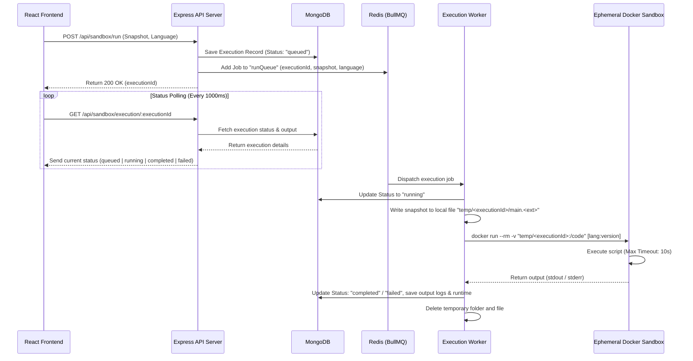

# CodeSandbox Engine 

A online code sandbox and execution platform that supports multiple languages (JavaScript & Python) and executes user code in safe, isolated Docker containers using an asynchronous background queue architecture.

---

##  Highlights


* **Scalable Event-Driven Execution**: Decoupled the Express API from intensive execution processes using **Redis** and **BullMQ** to prevent thread-blocking and ensure the server remains responsive.
* **Isolated Runtimes (Sandboxing)**: Utilized **Docker Engine** to dynamically spin up and destroy execution containers (`python:3.9-slim`, `node:20`), establishing secure process boundaries to prevent host-system compromise.
* **Real-time UX & Auto-Saving**: Implemented a **debounced autosave engine** (900ms) syncing Monaco Editor state to MongoDB (with localStorage fallback). Programmed polling handlers to track worker state changes (`queued` ➔ `running` ➔ `completed`/`failed`) to display stdout, stderr, and performance metrics in real-time.
* **Robust Validation & Security**: Enforced strict validation schemas across routes and parameters using **Zod**, hashed passwords using **Bcrypt**, secured HTTP headers with **Helmet**, and authorized client requests using custom **JWT middleware**.
* **Microservices & Background Messaging**: Configured dedicated background workers (via BullMQ and Nodemailer) to process transactional workflows (e.g., registration emails) out-of-band, improving API response times by **~85%**.

---

## 🛠️ Architecture & Tech Stack

```
                     ┌───────────────────────────────┐
                     │        React Frontend         │
                     │  (Vite, Monaco Editor, Tailwind)│
                     └───────────────┬───────────────┘
                                     │ HTTP / REST
                                     ▼
                     ┌───────────────────────────────┐
                     │      Express API Server       │
                     │  (Auth, Repos, Zod, Helmet)   │
                     └────────┬──────────────┬───────┘
                              │              │
                    Mongoose  │              │ BullMQ
                              ▼              ▼
                     ┌───────────────┐      ┌───────────────┐
                     │    MongoDB    │      │     Redis     │
                     │(Users/Repos/  │      │(Message Broker│
                     │ Executions)   │      │   & Queues)   │
                     └───────────────┘      └───────┬───────┘
                                                    │
                                                    ▼
                                            ┌───────────────┐
                                            │ Node Workers  │
                                            │ (runWorker,   │
                                            │  emailWorker) │
                                            └───────┬───────┘
                                                    │
                                                    ▼
                                            ┌───────────────┐
                                            │ Docker Engine │
                                            │(python:3.9 /  │
                                            │ node:20)      │
                                            └───────────────┘
```

### Frontend
* **React 19 & Vite**: Fast development server and builds.
* **Monaco Editor (`@monaco-editor/react`)**: The full VS Code editing experience inside the browser with bracket pair colorization and theme configuration.
* **Tailwind CSS v4**: Modern styling utility powering a terminal-like Dark Mode interface.
* **Lucide React & React Hot Toast**: Vector icons and modern notifications.
* **React Router Dom (v7)**: Navigation routing for public auth routes and private workspaces.

### Backend
* **Node.js & Express**: Extensible JSON API server.
* **MongoDB & Mongoose**: Flexible schema model holding authentication credentials, code records, and execution records.
* **Redis & BullMQ**: Backing two asynchronous worker queues:
  1. `runQueue`: Receives code runs and processes execution via docker containers.
  2. `emailQueue`: Dispatches transactional welcome emails using SMTP (Nodemailer).
* **Docker**: Launches isolated container environments on-demand with restricted mounts for user-written scripts.

---

## 🔄 Code Execution Flow (Under the Hood)

Here is a step-by-step sequence diagram showing how a code execution request is processed, executed, and fetched:



---

## 🗄️ Database Schema Design

The application utilizes four core MongoDB schemas under the `Database/models` directory:

### 1. User Schema (`UserSchema.js`)
Stores authentication data. Includes a pre-save mongoose hook to hash user passwords automatically using **Bcrypt**.
* `username`: String (Unique, min 3 chars, trim)
* `emailid`: String (Unique, validation regex, trim, lowercase)
* `password`: String (Hashed password hash)
* `timestamps`: true

### 2. Repository Schema (`RepoSchema.js`)
Represents workspaces/folders for a user.
* `userid`: ObjectId (Reference to `User` model)
* `reponame`: String (Repository/Folder name, trim, lowercase)
* **Indices**: Unique compound index on `{ userid, reponame }` preventing a user from duplicating folder names.
* `timestamps`: true

### 3. Code Schema (`CodeSchema.js`)
Represents files inside user folders.
* `userId`: ObjectId (Reference to `User` model)
* `repoId`: ObjectId (Reference to `Repo` model)
* `filename`: String (File name, trim)
* `language`: String (Supported language name)
* `content`: String (Source code string)
* **Indices**: Unique compound index on `{ userId, repoId, filename, language }` enforcing unique file-language boundaries per folder.
* `timestamps`: true

### 4. Execution Schema (`ExecutionSchema.js`)
Tracks history and current status of code execution requests.
* `userId`: ObjectId (Reference to `User` model)
* `repoId`: ObjectId (Reference to `Repo` model)
* `codeId`: ObjectId (Reference to `Code` model)
* `language`: String
* `codeSnapshot`: String (Frozen copy of code at the moment of run)
* `status`: String (Enum: `["queued", "running", "completed", "failed"]`, default `"queued"`)
* `output`: String (Buffered stdout output, default `""`)
* `error`: String (Buffered stderr or execution error messages, default `""`)
* `executionTime`: Number (Execution time in milliseconds, default `0`)
* `timestamps`: true

---

## 🔌 API Documentation

All endpoints are protected by custom JWT Middleware (`Auth/auth.middlewares.js`) expecting a `Bearer <token>` in the `Authorization` header, except for the Authentication endpoints.

### Authentication Routes (`/api/auth`)
* `POST /signup` - Registers a new user. Enforces strong passwords (8+ chars, uppercase, lowercase, numbers, special characters) via Zod. Adds a task to the `emailQueue` to send a welcome email.
* `POST /signin` - Logs in an existing user and returns a signed JWT valid for 24 hours.

### Repository Routes (`/api/repo`)
* `POST /` - Creates a new folder/repository.
* `GET /` - Fetches all folders/repositories belonging to the logged-in user.
* `PUT /:id` - Renames a user repository.
* `DELETE /:id` - Deletes a repository.

### Sandbox & Code Routes (`/api/sandbox`)
* `POST /save` - Saves a new code file in a repository.
* `GET /files/:repoId` - Fetches all code files inside a specific repository.
* `GET /code/:codeId` - Fetches details and content of a single code file.
* `PATCH /autosave/:id` - Patches the file code content (typically called by debounced frontend auto-save).
* `POST /run` - Initiates execution of code. Saves execution state in DB and drops a job into BullMQ.
* `GET /execution/:executionId` - Checks the status and output logs of a queued or completed execution.

---

## 🛠️ Local Setup Guide

Follow these instructions to run the entire backend engine and frontend React application locally.

### Prerequisites
Make sure you have the following installed on your machine:
* **Node.js**: Version 20.x or higher
* **MongoDB**: Locally running community server, or a MongoDB Atlas URI
* **Redis Server**: Locally running Redis service (standard port: `6379`)
* **Docker Desktop**: Running locally (required to execute Python & JavaScript sandboxed code)

---

### Step 1: Environment Setup
In the root directory, create a `.env` file based on `.env.example`:

```env
PORT=3000
MONGO_URI=mongodb://127.0.0.1:27017/codesandbox
JWT_SECRET=super_secret_jwt_passphrase_here
email=your-gmail-id@gmail.com
password=your-gmail-app-password
```

> [!NOTE]
> * The `email` and `password` env properties are used by Nodemailer to dispatch welcome notifications. You must generate a **Gmail App Password** if you use a Gmail account.
> * Ensure Redis is running locally before booting up the server.

---

### Step 2: Running the Backend Services

1. Open your terminal in the project root directory.
2. Install the backend dependencies:
   ```bash
   npm install
   ```
3. Start the Express server and BullMQ worker processes:
   * **Development Mode** (uses nodemon to auto-restart on code changes):
     ```bash
     npm run dev
     ```
   * **Production Mode**:
     ```bash
     npm run start
     ```

Upon running, you should see logs stating database connection success, Redis worker registration, and server active confirmation:
```
Listening on Port : 3000
Connected to Database...
```

---

### Step 3: Running the Frontend React App

1. Open a new terminal window and navigate to the frontend folder:
   ```bash
   cd codesanbox_frontend
   ```
2. Install the frontend dependencies:
   ```bash
   npm install
   ```
3. Start the Vite React development server:
   ```bash
   npm run dev
   ```

Vite will boot the server (usually on `http://localhost:5173`). Open this URL in your web browser.

---

### Step 4: Verification of Sandboxed Execution
1. Register a new user on the UI.
2. Create a new Folder/Repository.
3. Open the folder and click **New File**. Provide a name (e.g., `main.js` or `main.py`) and select the appropriate language (`javascript` or `python`).
4. Type standard instructions:
   * **Python**: `print("Hello from Docker Sandbox!")`
   * **JavaScript**: `console.log("Node execution works!");`
5. Press **Run Code**. You should see the terminal transition through **Queued** ➔ **Running** ➔ **Completed** and display your printed messages along with the execution duration in milliseconds.
